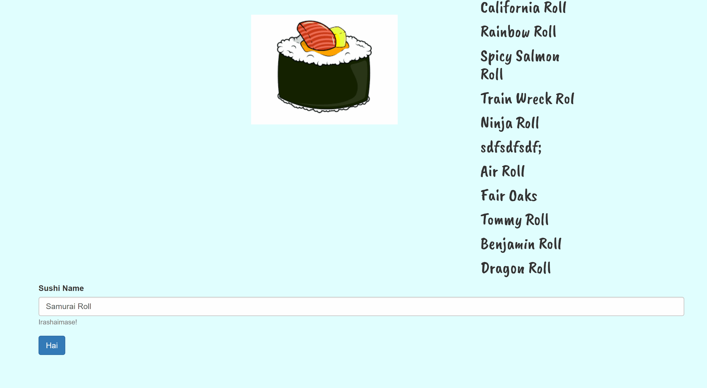

# Eat Da Sushi!
## Overview
A Node, Express, Handlebars, and MySQL sushi app that lets users input the names of sushi they'd like to eat... and then devour them! Please check out the launched app on Heroku here!

## How it works
Using a home-grown ORM, the app utilizes 3 basic CRUD functions:
1. READ all entries from the MySQL database and display them to the DOM using Handlebars.
2. UPDATE a selected sushi roll by clicking "Itadakimasu", which hits the /sushi/eat/:id route in express to change its "devoured" status in the MySQL database and sends the sushi roll to the devoured column.
3. CREATE a new sushi roll using the form input, which hits the /burger/create route in express to insert a new sushi roll into the MySQL database and sends the sushi roll to the ready to be eaten column.

## Demo
</img>
